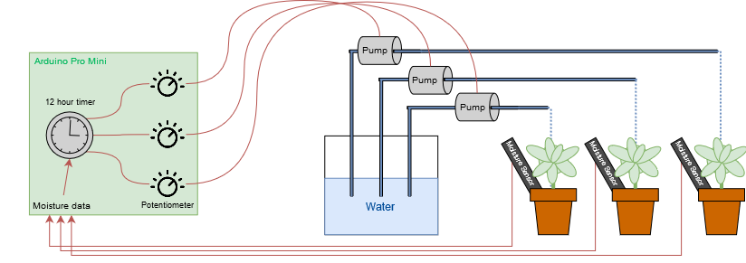

# AAWS
Automated Arduino Watering System

This is simple approach to an automated watering system using an Arduino Pro Mini, three individual water pumps and recycled potentiometers. 

## The overall system

## Essential code parts
WIP
