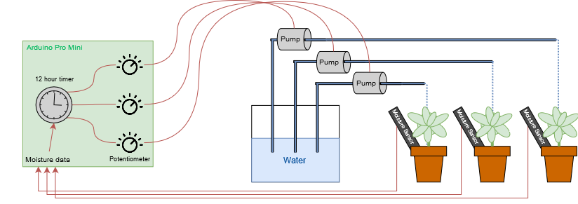

# Automated Arduino Watering System
This is simple approach to an automated watering system using an Arduino Pro Mini, three individual water pumps and recycled potentiometers. 

## The overall system
The system is based around an Arduino Pro Mini which every 12 hours checks the moisture of the attached plants and waters them for a set amount of time based on three control knobs. This ensures that if the plant has not consumed enough water during the 12 hour break, the pumps will not fire.



## Power consumption
Apart from variable declarations the most important parts of the code - and perhaps the ones which can be of use to others delving into a similar project - is concerning the power consumption during breaks. 

```c
void loop() {
  if (currentTime >= twelve) {
    // ...
    // Moisture checking and pump logic 
    // ...
  } else {
    currentTime = currentTime + 8;
    LowPower.powerDown(SLEEP_8S, ADC_OFF, BOD_OFF);
  }
}
```

The Ardiuno code uses the LowPower library (https://github.com/rocketscream/Low-Power) which allows for the Arduino Pro Mini to run for several days on a battery power source. As well as utilizing some hardware hacks to the Arduino Pro Mini, explained at: http://www.home-automation-community.com/arduino-low-power-how-to-run-atmega328p-for-a-year-on-coin-cell-battery/
